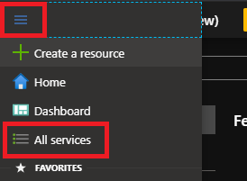
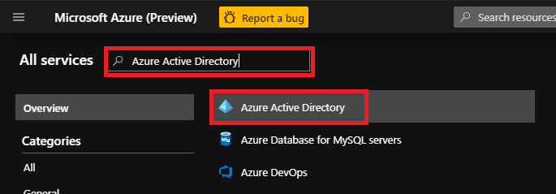
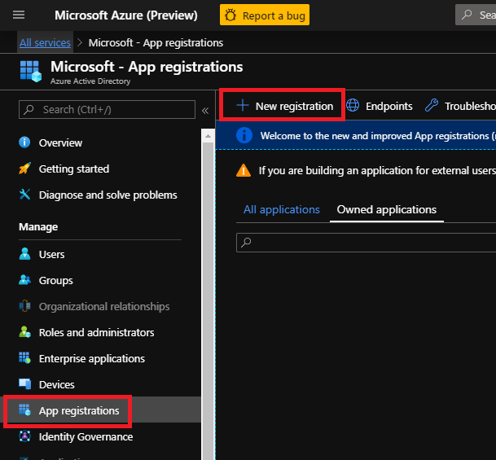
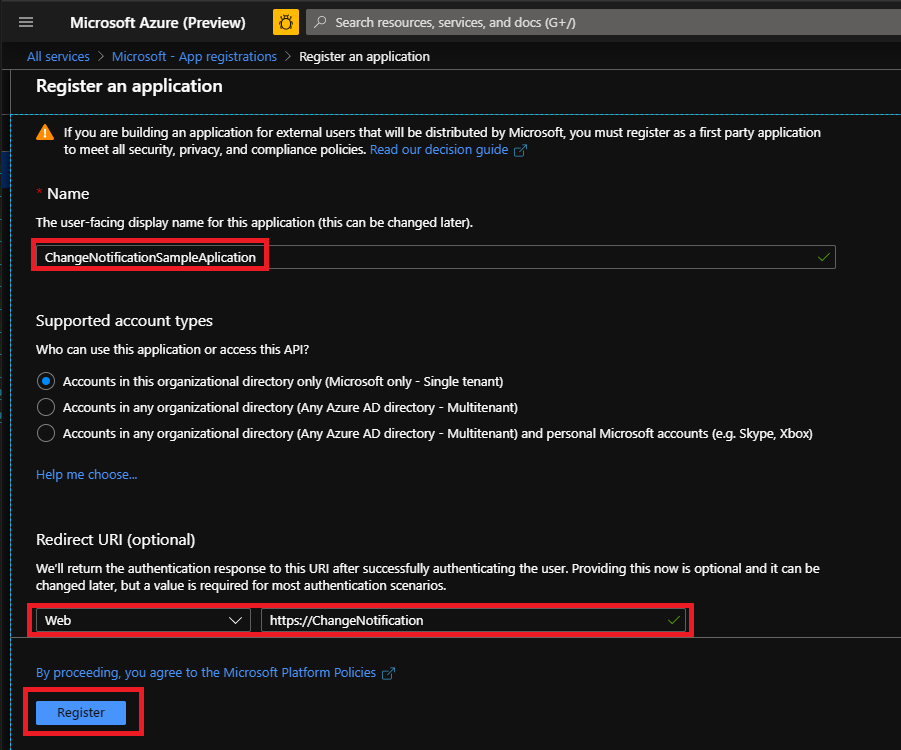
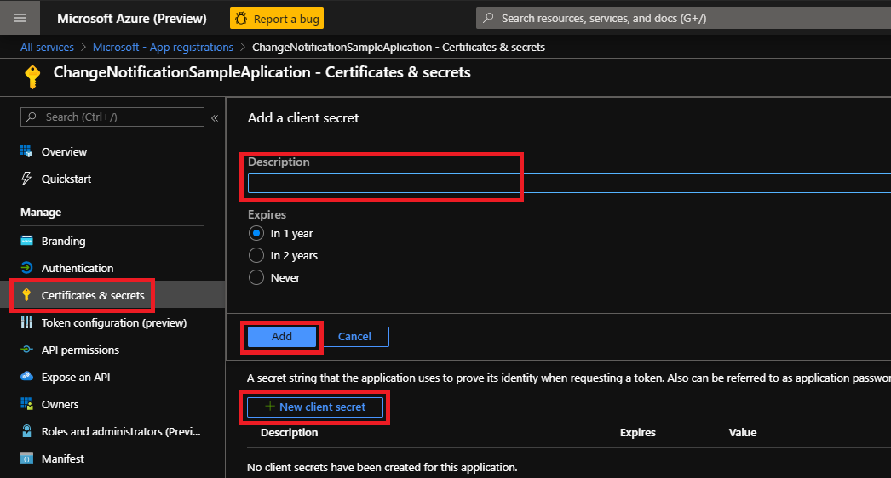

# Sample Application - Microsoft Graph Change Notifications with Resource Data


## Use this sample application to receive Change Notifications with Resource Data

### Pre-requesites

- A tenant administrator account on a Microsoft 365 tenant. You can get a development tenant for free by joining the [Microsoft 365 Developer Program](https://developer.microsoft.com/en-us/microsoft-365/dev-program).
- [Visual Studio Code](https://code.visualstudio.com/)
- [ngrok](https://ngrok.com/).
- [JDK13](https://docs.oracle.com/en/java/javase/13/install/)
- [Maven](https://maven.apache.org/) or [Gradle](https://gradle.org/).

### How the sample application works

The sample is configured to do the following:

- On a `GET` request on `/notification` create a subscription to a resource.
- Once an encrypted Change Notification is received, decrypt it and print it to console.

## Setting up the sample

1. Register a Microsoft Identity Platform application, and give it the right permissions.
1. Update NotificationController.java with information from the previous steps

### Register a Microsoft Identity Platform application

#### Step 1: Go to [Azure Portal](https://portal.azure.com/)

#### Step 2: Create an application registration

- Click on the navigation icon in the Azure Portal, click on "All services"; on the next screen search for "Azure Active Directory" and then click on "Azure Active Directory"

    

    

- Click on "App registrations",  then click on "+ New registration"; Fill in the required details as shown below and click "Register"

    

    

- Go to the Application, click "Certificates & secrets", then click "+ New client secret", Add a description and then click "Add" and save the secret somewhere, you will need to add this to the configuration.

    

- Select the **API permissions** page. Click **Add a permission**, then select **Microsoft Graph**, **Application permissions**, **ChannelMessage.Read.All**. Click **Add permissions**.  

    Note: the following permissions are required for Change Notifications with Resource Data which today is implemented only for Microsoft Teams. The sample also works with regular Change Notifications and you find permissions for the resources you are interested in subscribing to [here](https://docs.microsoft.com/en-us/graph/api/subscription-post-subscriptions?view=graph-rest-beta&tabs=http#permissions)

### Generate the self-signed certificate

This step is only required if you subscribe to Resources with Data. As the payload is encrypted, it requires a certificate to ensure only you will be able to decrypt the payload. To generate a self-signed certificate run the following command from the sample folder. After running the command a file named `JKSkeystore.jks` should appear at the root of the repository.

```shell
keytool -genkey -keyalg RSA -alias selfsignedjks -keystore JKSkeystore.jks -validity 365 -keysize 2048
```

Note: this command will request for a password to protect the keystore, write it down, you'll need it later.

### Update NotificationController.java

#### Step 1: Open the sample in Visual Studio Code and then open NotificationController.java file to update the following settings

- **clientId**: Client Id of the application registration used to create the Change Notification subscription.
- **clientSecret**: Client Secret of the application registration used to create the Change Notification subscription.
- **tenantId**: Tenant Id for which the Change Notification subscription needs to be created (Can be found on the application registration page).
- **publicUrl**: The HTTPS Notification URL. (if you are debugging locally you can use [ngrok](https://ngrok.com/) by typing `ngrok http 8080 -host-header=rewrite` in a separate console and use the generated URL eg. `https://3a5348f1.ngrok.io` ).
- **changeType**: CSV; possible values created, updated, deleted.
- **resource**: resource to create subscription for (e.g. teams/allMessages).
- **storepass**: The password to be used for the keystore. This is the password you entered during the self-signed certificate generation step. This is only needed for Change Notifications with Resource Data.

#### Step 2: In the Solution Explorer, right click on the "TeamsGraphChangeNotification" project and select "Set as StartUp Project" and click start (or play button)

#### Step 3: Open the Microsoft Teams client and send a message for the resource to which the subscription is created. The message will be received, decrypted and printed on the console

### Start the application

Open the repository with Visual Studio Code. Press F5.

Alternatively if you are not using Visual Studio Code, from the root of the repository:

```shell
gradle run
```

Or (depending on your favorite tool)

```shell
mvn install
mvn package
java -jar target/rest-service-0.0.1-SNAPSHOT.jar
```

### Create the subscription

Open a browser to `https://<yourNgrokUrl>/notification` (or `http://localhost:8080/notification`).

### Testing the application

Start generating events (eg creating messages for Teams), you should see `notification received` messages in console. If you are implementing Change Notifications with Resource Data you should also see `decrypted data` followed by the decrypted data in the console.

## Troubleshooting

See the dedicated [troubleshooting page](./TROUBLESHOOTING.md).

## Contributing

If you'd like to contribute to this sample, see [CONTRIBUTING.MD](./CONTRIBUTING.md).

This project has adopted the [Microsoft Open Source Code of Conduct](https://opensource.microsoft.com/codeofconduct/). For more information see the [Code of Conduct FAQ](https://opensource.microsoft.com/codeofconduct/faq/) or contact [opencode@microsoft.com](mailto:opencode@microsoft.com) with any additional questions or comments.

## Questions and comments

We'd love to get your feedback about the Microsoft Graph Webhooks sample for ASP.NET Core. You can send your questions and suggestions to us in the [Issues](https://github.com/microsoftgraph/java-spring-webhooks-sample/issues) section of this repository.

Questions about Microsoft Graph in general should be posted to [Stack Overflow](https://stackoverflow.com/questions/tagged/MicrosoftGraph). Make sure that your questions or comments are tagged with *[MicrosoftGraph]*.

You can suggest changes for Microsoft Graph on [UserVoice](https://microsoftgraph.uservoice.com/).

## Additional resources

- [Microsoft Graph Webhooks sample for Node.js](https://github.com/microsoftgraph/nodejs-webhooks-rest-sample) (Delegated permissions)
- [Microsoft Graph Webhooks sample for ASP.NET core](https://github.com/microsoftgraph/aspnetcore-webhooks-sample)
- [Working with Webhooks in Microsoft Graph](https://docs.microsoft.com/graph/api/resources/webhooks)
- [Subscription resource](https://docs.microsoft.com/graph/api/resources/subscription)
- [Microsoft Graph documentation](https://docs.microsoft.com/graph)

## Copyright

Copyright (c) 2020 Microsoft. All rights reserved.
